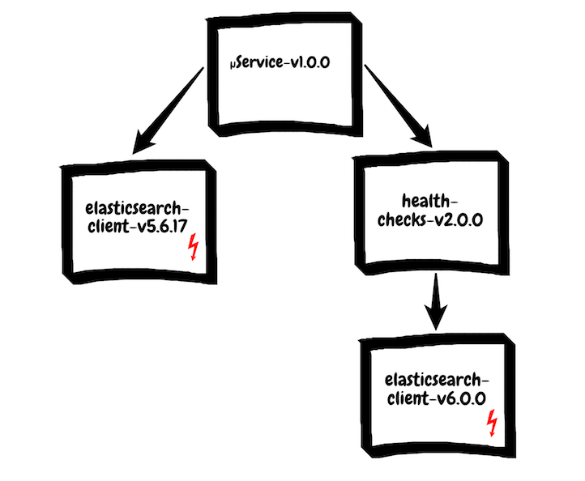

# Shared code in microservices

Microservices have long ceased to be a hype topic. Countless blog articles, books, best practices, tweets and war stories from concrete projects testify to a living architectural style. There is hardly a question that has not been repeatedly examined from all sides: starting with the basic concept and the technical layout, to topics such as team and communication structure, deployment, service discovery, logging and monitoring, there is enough literature, instructions, Frameworks and tools. This article is therefore not another comprehensive introduction to microservices, even if some core principles are touched upon.

Rather, it is about a topic that comes up again and again with reliable regularity and that concerns conference experts as well as developers in the verbal scuffle in the coffee kitchen: Can one reuse code in microservice projects or not? Do you always have to reinvent the wheel or copy code to implement microservices according to the pure teaching? Is shared code, in whatever form, a brutal violation of the isolation principle? Or does “Don't Repeat Yourself” also apply here?

## Loose coupling and isolation

Microservices should not be a technical end in themselves. One of the core goals in the introduction of microservices is the extensive decoupling of components that are designed and implemented under technological autonomy and communicate via uniform interfaces. The purpose is to better manage complexity, a higher degree of isolation during the application period and the goal to test business ideas and technologies faster and to throw them away again if they prove to be unsuitable.

A microservice typically implements the business process of a specialist domain, ie it maintains and changes its own locally valid data, is responsible for its management and exposes explicit interfaces to the outside. So it is "reasonably small" and focuses on a specific task. This strict modularization concept and the division of the teams into domain components [1] result in several other advantages:

* Independent release and deployment of the services (while maintaining backward compatibility of interfaces)
* Separate life cycles
* Scaling according to needs
* Greater technological independence, since ideally there are no direct dependencies on other microservices
* Fast local decisions on technical and micro-architectural questions by autonomous teams
* Less coordination effort between the different teams
* Freedom of choice of technology (languages, frameworks), thereby greater team commitment [2] 

But even in microservice projects, there is often a desire for shared use of database schemas, data sources, code for access to frequently used objects in a domain or existing functionality. There are two forces working in different directions at one point: the “maximum generic reusability” on the one hand, the concept of independence and isolation on the other.

## The promise of salvation of reusability

The strong desire for reusability is not surprising, after all, the DRY principle has been the mantra of software development for decades. And even today developers are being instilled, redundancy is the worst of all developer villains, after all it would make more sense to "inherit" code instead of writing. What can be reused does not have to be rewritten and thus reduces costs. Reusable code should ideally meet the following requirements:

* Must fit in many cases
* High quality
* Good documentation 

It is not uncommon to argue here that the disclosure of such code in an open source project automatically fulfills the requirements described above, since external contributions and bug reports lead to an improvement in the code. Publication as an open source library actually makes sense, after all, you don't want to use code that you wouldn't be willing to distribute to external users. But even if it makes it difficult for specific things to get into such a shared project, one crucial question remains unanswered: Where exactly is the boundary between sensible code sharing and excessive generalization?

Answers to this are provided by the concept of bounded context from Domain Driven Design (DDD) , an approach to software modeling that focuses very strongly on the professionalism of an application domain .

## Bounded context

The urge to generalize everything has led to global data models and wrong technical abstraction in many past projects. Instead of promising productivity boosts, this procedure slows down the development process. The reason for this is obvious: A technically incorrect generalization leads to a high coordination effort, since many developers involved have to coordinate with each other. Finally, it has to be decided which code ends up in a shared component and how its quality is ensured. If you then have to deal with an entire organization that is dedicated to “cross-sectional tasks”, in extreme cases it is no longer the specialist department in contact with the customer that is the driver, but the cross-sectional unit as guardian of the grail of reusability [3].

In contrast, the concept of bounded context is central to domain driven design. Each domain usually consists of several bounded contexts. Such a “context boundary” describes the scope of a technical model.

For a better understanding of this definition, a simple example should serve: The term flight from the aviation industry has its own meaning, depending on the context. From the point of view of a passenger, a flight is the transportation of people to a destination airport, either in the form of a direct flight or with a stopover. From the point of view of the on-board personnel, a flight consists of take-off and landing. And airport maintenance technicians look at a flight from the perspective of aircraft maintenance. Depending on the context, this term means something different.

Modeling a flight in the form of a generic flight class would only lead to confusion. Rather, what is meant by a flight in individual cases should be modeled in its own bounded context. Attempting to outsource commonalities to a parent class and to implement individual characteristics in child classes inevitably leads to strong coupling [4].

As a rule of thumb we can remember:

* Duplication is better than false abstraction
* Redundancies should be consciously accepted if the alternative is a strong coupling
* No reuse of business logic across multiple bounded contexts 

Code reuse for technical code within a bounded context, however, is not critical.
Shared domain model

There are use cases in which areas of the domain model have to be divided between different bounded contexts. Instead of multiple implementations with inconsistencies, it is conceivable in such cases that the producer (service supplier) and consumer (service consumer) share common structures. Here, for. B. the domain model of the producer can be used directly in the consumer ( shared kernel ). Interactions and dependencies on other microservices can also be managed with the help of an anti-corruption layer , which provides the consumer with a mapping to their own domain model. Both approaches are part of the context maps described in the DDD and can be used even if the consumer does not need all the attributes of the domain model provided by the producer.

Of course, this procedure contradicts the principles of loose coupling and isolation mentioned above, because the independence between microservices is lost, particularly in the shared kernel variant. This procedure is a trade-off and needs to be weighed up in line with usage. It should not be used as a justification for a universal data model in a complex application landscape. Nevertheless, there are scenarios such as session or authentication logic, where such a procedure is appropriate.

Two things are important here: a healthy communication culture between the teams in question and a shared domain model that is as stable as possible, the changes of which should at least be backwards compatible until all consumers have been brought up to date.

## Cross-cutting concerns

What about libraries like Apache Commons or Google Guava? The short answer is: Shared libraries for technical issues such as logging, monitoring, tracing, string manipulation, collections or abstraction layers for infrastructure access are cross-cutting concerns, since they do not depend on the context of a domain. It is perfectly okay to share libraries that involve non-technical aspects [5].

### Dependency Hell

However, this answer does not address the problem that such libraries often have the disadvantage of many transitive dependencies. It is only a matter of time before you catch version conflicts and it is not uncommon for you to end up in the infamous Dependency Hell.

One way to avoid the dependency hell problem is to provide very lean libraries for clearly defined tasks with little or no dependency. Such libraries are in stark contrast to general-purpose libraries. An alternative to this is the use of project templates that provide a basic framework with basic functionalities. According to the top-down approach, this template can be expanded in any service. In his book on Domain Driven Design, Eric Evans even goes so far as to extend this approach to the concept of the shared kernel: different teams change their own copy of the shared kernel and the various changes are brought together again at regular intervals. Admittedly, not everyone likes this idea of ​​continuous copy & paste and re-merging.

### Deployment Dependencies

The following scenario, which originates from a real project, is somewhat more complex: A library for health checks checks, among other things, the connection to Elasticsearch and the existence of certain indices and aliases. Under the hood, this library uses an open source library that provides an Elasticsearch client. In the context of a user story, new features have been added to the health check library. At the same time there was an upgrade to a new major version [6] of the Elasticsearch client. As a result, additional adjustments had to be made.

In our specific example, services that use the new health checks also use the same Elasticsearch client in their own (technical) code, only in an older version. Similar adjustments had to be made in the services concerned, which increased the effort immensely. In this case there are two solutions:

* Replacement of the Elasticsearch client in the health checks with a lightweight solution (checking the connection etc. does not need all the features of a comprehensive Elasticsearch client)
* (Temporary) provision of the Health Check Library in two versions: one with the old and one with the new version of the Elasticsearch client 

At first glance, both approaches seem like unnecessary trouble. However, with several dozen services, this effort prevents extensive "forced upgrades", the inclusion of the new health checks can be done gradually.

The following scenario goes in a similar direction: Assume that a shared library is provided for the use of a central service. If changes are made to this service, all microservices should use an updated version of this library. If the services in question are managed by different teams, this entails a considerable coordination effort in redeployment.

Backward-compatible changes to the service, on the other hand, do not result in deployment dependencies, since older versions of this library are therefore still supported. Temporary provision of two different versions of the service including two different library versions is also conceivable. The older variant is then switched off as soon as it is ensured that no client is dependent on it anymore.

In general, in the case of external dependencies in a microservice, the freedom of choice of the specific version of a library used should always be ensured to avoid dependencies of this kind.

## Shared infrastructure as code

In the sense of healthy, productive team autonomy and to avoid infrastructure monoliths, it is recommended to divide the Infrastructure as Code area according to macroarchitecture and microarchitecture aspects. Within the limitation of a microservice, all infrastructure definitions that belong directly to its domain should also be made. An example to illustrate this: A microservice that installs data and then stores it in a message queue is a candidate for storing the infrastructure definition of the topic of the message queue in question. The subscriptions of the queue, on the other hand, should be defined in services, which data consume from this topic.

All infrastructure definitions that cannot be clearly assigned to a service are aspirants for the macro infrastructure (or macro stack). So this stack contains all cross-cutting aspects and ideally consists exclusively of definitions, which rarely change. This typically includes the network and security infrastructure [7]. The division into various service stacks (micro-stacks) and a macro smacdtack can be implemented, for example, using the modularization and inclusion concepts of Terraform and CloudFormation.
Summary

Shared code or code reuse in microservices leads to dependencies, which can lead the core idea of ​​this architecture style to absurdity. Therefore, one should orientate oneself on the idea of ​​the bounded context of domain driven design and differentiate between technical and non-technical aspects. The latter can be converted into shared code. However, it is recommended to keep it lean and to ensure that it is backwards compatible when changes are made to avoid deployment dependencies. The shared domain model pattern should be used with care and also requires a healthy communication culture between the teams. Infrastructure as code is to be assessed from a similar point of view as program code.

---

[1] See http://www.informit.com/articles/article.aspx?p=2738465&seqNum=2  
[2] This freedom of choice is often restricted in practice in order to avoid a technology zoo.   
[3] In addition, the flexibility achieved when focusing on reusability also leads to an increase in complexity. One also speaks of the use / reuse paradox: http://techdistrict.kirkk.com/2009/10/07/the-usereuse-paradox/.   
[4] The statement applies not only to microservices projects, but generally wherever you want to modularize sensibly. In addition, changes to the base class will quickly violate the Liskov substitution principle: http://newsight.de/2015/01/07/das-liskov-substitution-principle.  
[5] We limit ourselves to Java in this scenario, but the statements made here also apply to other languages.  
[6] Semantic versioning: https://semver.org/.  
[7] See https://www.infoq.com/news/2018/06/cloud-native-continuous-delivery 